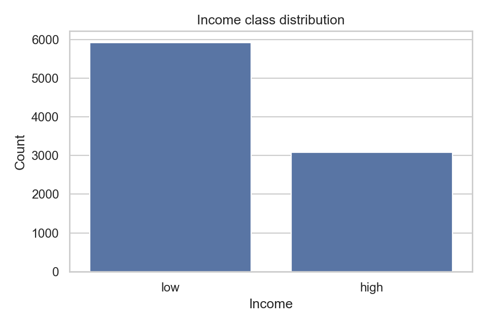

# Data Mining Assignment 4 - Classification

**Student:** Niyazi Cenk Genek - 20259604

**GitHub repository:** https://github.com/cegkaisen/data-mining-classification

---

## 1. Introduction

This project is about predicting whether a person is in the `high` or `low` income class. The model uses the demographic and socioeconomic fields in `income.csv`, then produces predictions for the unlabeled file `income_test.csv`.

I treated the task as more than a leaderboard-style classification problem. Income prediction can be sensitive, because the output might be interpreted as evidence about real people. So I checked the usual performance metrics, but I also looked at overfitting, model explanations, and gender fairness. Accuracy was useful, but it was not enough on its own.

The implementation is organized into reusable Python code under `src/`, notebooks under `notebooks/`, and the final prediction file at `outputs/predictions.csv`.

---

## 2. Data Exploration

The training file has **9000 rows**. The separate test file, `income_test.csv`, has **2000 rows** and no target label. In the training data, the target is not perfectly balanced: `low` appears 5921 times, which is **0.658** of the data, while `high` appears 3079 times, or **0.342**.

That class balance shaped the evaluation. A model could look acceptable by handling the larger `low` class well, while still missing many `high` examples. Because of that, I used AUC, precision, and recall together with accuracy.

Two columns stood out because they had many missing values:

- `ability to speak english`
- `gave birth this year`

I kept them in the main dataset instead of dropping them immediately. Missing values can sometimes carry information, especially in survey-style data. Later, I tested what happens when those columns are removed.

---

## 3. Preprocessing

All preprocessing was built with `sklearn` pipelines. This kept the transformations tied to the training split or training fold, which is important for avoiding leakage.

The pipeline does the following:

1. Fill numeric missing values with the median.
2. Standardize numeric features.
3. Replace categorical missing values with a `missing` category.
4. Apply one-hot encoding to categorical variables.
5. Ignore unknown validation or test categories safely.

This setup matters because the validation data should stay unseen until evaluation time. If the imputer, scaler, or encoder were fitted before the split, the validation results would be too optimistic. The same idea also applies inside cross-validation during tuning.

---

## 4. Classification Methods

For Task 1, I compared three classifiers:

1. **Logistic Regression**
2. **Random Forest**
3. **HistGradientBoosting**

Random Forest and HistGradientBoosting both count as ensemble models, so the ensemble requirement is covered.

I started with baseline models, then tuned the hyperparameters using 3-fold StratifiedKFold on the training split. The validation split was held back for the final comparison. I did not use `income_test.csv` for model choice, threshold tuning, or feature selection.

The main selection metric was validation AUC. I still reported accuracy, precision, and recall for both classes, because AUC does not show the full behavior at the final prediction threshold.

---

## 5. Model Results

The strongest final candidate was **HistGradientBoosting / tuned_full**.

| Model / variant | Accuracy | AUC | Precision high | Recall high | Precision low | Recall low |
|---|---:|---:|---:|---:|---:|---:|
| HistGradientBoosting / tuned_full | 0.784 | 0.854 | 0.709 | 0.628 | 0.817 | 0.866 |
| Random Forest / sex_removed | 0.777 | 0.853 | 0.722 | 0.568 | 0.798 | 0.886 |
| Random Forest / high_missing_removed | 0.779 | 0.853 | 0.728 | 0.565 | 0.797 | 0.890 |

The Random Forest variants were very close in AUC, so this was not a huge win for one model. I selected HistGradientBoosting because it had the best validation AUC and a better recall for the `high` class than the closest Random Forest alternatives.

Final model parameters:

- `learning_rate = 0.08`
- `max_iter = 100`
- `max_leaf_nodes = 15`

---

## 6. Overfitting and Hyperparameter Tuning

To check overfitting, I compared train AUC with validation AUC after tuning.

| Model | Train AUC | Validation AUC | AUC gap |
|---|---:|---:|---:|
| Logistic Regression | 0.860 | 0.843 | 0.017 |
| Random Forest | 0.909 | 0.853 | 0.056 |
| HistGradientBoosting | 0.897 | 0.854 | 0.043 |

Logistic Regression had the smallest gap, but it also had a lower validation AUC. Random Forest had the largest gap, which suggests it was more prone to overfitting. HistGradientBoosting sat between the two. It still had a visible gap, but the validation score was the best among the tuned models.

The main overfitting control step was hyperparameter tuning. For the tree-based models, I limited complexity through depth-related settings, leaf size, learning rate, number of iterations, and leaf nodes. This was especially helpful for Random Forest, since the untuned version fit the training data almost too well.

---

## 7. Feature Selection and Class Imbalance

For feature selection, I used ablation tests. The idea was simple: remove a feature group, retrain, and see whether the validation behavior changes.

I compared:

- the full feature set
- the feature set without the high-missing columns
- the feature set without `sex`

The results were close. Removing the high-missing columns gave a best AUC of **0.853**, almost the same as the full model. Removing `sex` also produced a best AUC of **0.853**. So neither group was the single reason the model worked.

I also tested `class_weight="balanced"` for Logistic Regression and Random Forest. Balanced Random Forest raised `high` recall to **0.791**, which would be attractive if the main goal was to catch as many `high` cases as possible. The tradeoff was weaker precision and AUC balance. I kept HistGradientBoosting as the final model because its overall validation profile was more stable.

---

## 8. Explainability

For Task 2, I used **SHAP** to explain the final model. The most important global features were:

`age`, `workinghours`, `education`, `marital status_Husband`, and `sex_Female`.

These results make practical sense. Age, education, and working hours can be related to income. Marital status and gender-related variables may also capture patterns in the dataset, but they need to be interpreted carefully because they raise fairness concerns.

I also generated two local explanations:

- one correct `high` prediction from the validation set
- one correct `low` prediction from the validation set

I used validation examples for these local explanations because their true labels are known. I did not use examples from `income_test.csv` for explanation claims, since that file has no labels.

---

## 9. Final Prediction Output

For Task 3, I refit the final pipeline on all of `income.csv` and used it to predict labels for `income_test.csv`. The submitted prediction file is `outputs/predictions.csv`.

Verification checks:

- The file contains exactly **2000 rows**.
- The columns are exactly `id,income`.
- The `id` order matches `predictions_template.csv`.
- The predicted labels are only `high` or `low`.
- There is no extra unnamed index column.

The model predicted **1028** people as `high`, giving a predicted high rate of **0.514**. The other **972** rows were predicted as `low`, with a rate of **0.486**.

Because `income_test.csv` has no labels, I cannot know the real score on that file. My estimated performance comes from validation and cross-validation results. The final model reached validation AUC **0.854** and validation accuracy **0.784**, with usable precision and recall for both classes.

---

## 10. Gender Fairness

I checked gender fairness using the `sex` column on the validation split. The final model predicted `high` much more often for the male group than for the female group. The Female positive prediction rate was **0.132**, while the Male positive prediction rate was **0.386**. That gives a positive prediction rate gap of **0.254**.

I also tested a model variant without `sex`. The gap went down to **0.228**, but it did not disappear. This is the key point: removing a protected attribute does not automatically make a model fair. Other variables can still behave like proxies.

To improve this in a real setting, I would bring fairness metrics into model selection directly, inspect likely proxy variables, and test threshold changes on validation data. I did not tune group-specific thresholds here because I wanted the final prediction rule to stay simple and reproducible.

---

## 11. Conclusion

The final model is HistGradientBoosting. It had the best overall validation result, with AUC **0.854**, accuracy **0.784**, and reasonable precision and recall for both income classes. Hyperparameter tuning helped control overfitting, and the ablation tests showed that removing high-missing columns or `sex` did not strongly change AUC.

SHAP pointed to age, working hours, education, marital status, and gender-related features as important model drivers. The prediction file was generated successfully for all 2000 rows in `income_test.csv`.

The model is useful, but it is not perfect. The fairness check showed a clear difference in positive prediction rates between Female and Male groups. Removing `sex` helped only slightly, so a stronger fairness-aware workflow would need to include fairness metrics during model or threshold selection.
