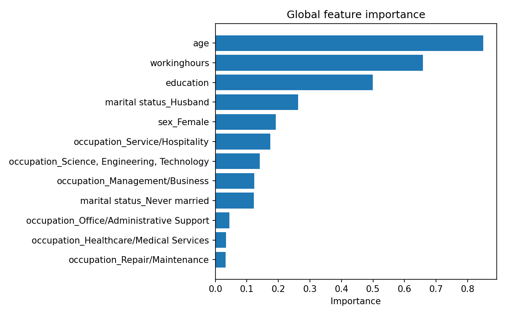

# Data Mining Assignment 4 - Classification

**Student:** Niyazi Cenk Genek - 20259604  
**GitHub repository:** https://github.com/cegkaisen/data-mining-classification

## 1. Problem, Data, and Preprocessing

In this assignment, I worked on a binary income classification problem. The target is whether a person is in the `high` or `low` income class. The training file, `income.csv`, has **9000 rows** and includes the target. The test file, `income_test.csv`, has **2000 rows** and does not include labels, so I used it only at the end for prediction.

The target classes are not fully balanced. There are 5921 `low` cases, which is **0.658** of the training data, and 3079 `high` cases, which is **0.342**. Because of this, accuracy alone would not be enough. A model could predict many `low` cases correctly and still miss too many `high` cases.

I used `sklearn` pipelines for preprocessing. Numeric missing values were filled with the median and then standardized. Categorical missing values were changed to a `missing` category and then one-hot encoded. I also used `handle_unknown="ignore"` so that new categories in validation or test data would not break the pipeline. The preprocessing was fitted only on the training split or inside each cross-validation fold. This was important to avoid data leakage.

Two columns had a lot of missing values: `ability to speak english` and `gave birth this year`. I did not drop them immediately, because missing values can still contain useful information. Instead, I kept them in the main model and tested their effect later.

## 2. Models and Evaluation Setup

For Task 1, I trained Logistic Regression, Random Forest, and HistGradientBoosting. Random Forest and HistGradientBoosting are ensemble models, so the ensemble model requirement is covered.

I first compared baseline models. After that, I tuned the models with 3-fold StratifiedKFold on the training split. The validation split was kept separate for the final comparison. I did not use `income_test.csv` for tuning, feature selection, threshold selection, or performance evaluation.

I used validation AUC as the main selection metric. Still, I also reported accuracy, precision, and recall, because AUC does not tell the whole story at the final prediction threshold.

## 3. Results, Tuning, and Feature Selection

The best final model was **HistGradientBoosting / tuned_full**. Its parameters were `learning_rate=0.08`, `max_iter=100`, and `max_leaf_nodes=15`.

| Model / variant | Acc. | AUC | Prec. high | Rec. high | Train AUC | AUC gap |
|---|---:|---:|---:|---:|---:|---:|
| HistGradientBoosting / tuned_full | 0.784 | 0.854 | 0.709 | 0.628 | 0.897 | 0.043 |
| Random Forest / tuned_full | 0.776 | 0.853 | 0.725 | 0.555 | 0.909 | 0.056 |
| Logistic Regression / tuned_full | 0.784 | 0.843 | 0.729 | 0.589 | 0.860 | 0.017 |

HistGradientBoosting had the best validation AUC and better recall for the `high` class than the tuned Random Forest. Logistic Regression had the smallest gap between train and validation AUC, but its validation AUC was lower. Random Forest had the largest gap, so it looked more overfit.

Hyperparameter tuning helped control overfitting. For the tree-based models, I limited model complexity with parameters related to depth, leaf size, learning rate, number of iterations, and leaf nodes.

For feature selection, I used simple ablation tests. I removed one feature group at a time and compared the results. Removing the high-missing columns gave about **0.853** AUC, almost the same as the full model. Removing `sex` also gave about **0.853** AUC. So these feature groups were not the only reason for the model's performance.

I also tested class imbalance handling with `class_weight="balanced"` for Logistic Regression and Random Forest. Balanced Random Forest increased `high` recall to **0.791**. This is useful if the goal is to catch more `high` cases, but the precision and overall balance became weaker. I chose HistGradientBoosting because it was more balanced overall.

## 4. SHAP Explainability and Final Predictions

For Task 2, I used SHAP to explain the final model. The most important global features were `age`, `workinghours`, `education`, `marital status_Husband`, and `sex_Female`. Age, education, and working hours make sense for income prediction. The gender-related feature is also important in the model, but this needs to be treated carefully because of fairness.

I also created two local SHAP explanations from the validation set: one correct `high` prediction and one correct `low` prediction. I used validation examples because their labels are known. I did not use `income_test.csv` for this part, because that file has no labels.

For Task 3, I refit the final pipeline on all of `income.csv` and predicted labels for `income_test.csv`. The output file is `outputs/predictions.csv`. It has exactly **2000 rows**, the columns are exactly `id,income`, the `id` order matches `predictions_template.csv`, and the labels are only `high` or `low`.

The model predicted **1028** people as `high`, so the predicted high rate is **0.514**. It predicted **972** people as `low`, with a rate of **0.486**. Since `income_test.csv` has no labels, I cannot know the real score on that file. The estimated performance comes from validation and cross-validation results. The final model had validation AUC **0.854** and validation accuracy **0.784**.

## 5. Fairness and Conclusion

I checked gender fairness on the validation split using the `sex` column. The model predicted `high` much more often for Male than for Female. The Female positive prediction rate was **0.132**, while the Male rate was **0.386**. The gap was **0.254**.

I also tested a model without `sex`. The gap decreased to **0.228**, but it did not go away. This shows that simply removing a protected attribute is not enough. Other variables can still carry similar information.

Overall, HistGradientBoosting was the best model for this assignment. It had the best validation AUC, reasonable precision and recall, and it produced a valid prediction file for all 2000 unlabeled test rows. The main weakness is fairness. If I continued this work, I would include fairness metrics during model selection and test threshold changes on validation data before making final predictions.
